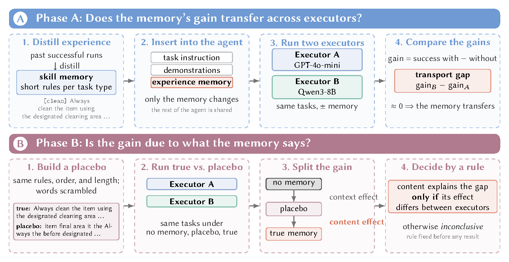

# SkillRC: Is It the Skill or the Stack? Auditing Experience Memory in Agent Harnesses

**Yiwen Lu** · University of Notre Dame · ylu37@nd.edu

[Project page](https://eveneureka.github.io/SkillRC/) · [Paper (PDF)](docs/static/skillrc_paper.pdf)

**SkillRC** is a controlled experience-memory harness for auditing the *experience*
component of agent harnesses: the distilled insights, trajectories, or procedures
that a harness injects into a frozen LLM executor. RC stands for *reality check*.
SkillRC varies only the executor stack and the memory's content, representation,
presentation, and footprint, keeps the agent loop, decoding, and action parsing
identical across configurations, and asks three questions in turn, of which a
with-memory vs. without-memory comparison answers only the first:

1. **Does the memory improve the system?** It estimates the paired memory effect on
   identical tasks, prompts, and artifacts for the stack the memory was built with.
2. **Does the gain transfer across executor stacks?** It repeats the estimate on a
   second stack and reports the *transport gap* between stacks.
3. **How much of the gain comes from the skill's content?** It compares the true payload
   with two payload-matched controls that keep the same items, retrieval order, and token
   footprint: an **order placebo** that removes every original adjacent word pair, and a
   **coherent, task-irrelevant memory**. The decision rules are frozen before outcomes are inspected.

<p align="center"></p>

**Project page:** [`docs/index.html`](docs/index.html) (served by GitHub Pages) ·
**Paper:** [`paper/manuscript.pdf`](paper/manuscript.pdf) (manuscript)

## Key findings (ALFWorld, 134 unseen tasks)

| Quantity | Estimate | 95% CI |
|---|---:|---:|
| GPT-4o-mini memory gain (33 insights, 645 tokens, BM25) | +0.127 | [+0.072, +0.184] |
| Qwen3-8B memory gain | −0.021 | [−0.062, +0.020] |
| Transport gap (Qwen − GPT) | **−0.148** | [−0.218, −0.080] |
| Order placebo vs. none, GPT / Qwen (first 60-task gate, 2026-07) | +0.089 / −0.108 | [+0.025, +0.153] / [−0.164, −0.053] |
| Same-window rerun (2026-10-10, 60 games): true vs. scrambled placebo, GPT / Qwen | +0.106 / +0.083 | [+0.028, +0.183] / [+0.022, +0.144] |
| Rerun: true vs. coherent task-irrelevant control, GPT / Qwen | +0.106 / +0.050 | [+0.039, +0.172] / [−0.022, +0.128] |
| Rerun: coherent irrelevant vs. scrambled, GPT / Qwen | 0.000 / +0.033 | [−0.072, +0.072] / [−0.028, +0.094] |
| WebShop reward change with memory (Qwen3-8B, 100 sessions) | −0.090 | [−0.165, −0.016] |

The memory helps the stack it was built with, on every demonstration pair and with the
smallest payload tested, and does not help the second stack. A pre-registered same-window rerun with two
payload-matched controls (a scrambled placebo and a coherent memory about gardening with the same tags,
word counts, order and 645-token footprint) locates the benefit in the memory's task-relevant content: the
two controls behave alike and the true memory exceeds them. The stacks differ in what reading an added
block costs: Qwen3-8B loses with any added payload, which leaves its net gain near zero. The first gate's
placebo effect on GPT-4o-mini did not reproduce on the rerun's (different) sample of games. Data,
pre-registration and per-episode logs of the rerun are in `data/summaries/rerun_2026-10-10/`.
See the paper for task-level transport maps and the context-cost audit.

## Install

```bash
python -m venv .venv && source .venv/bin/activate
pip install -r requirements.txt
```

## Quickstart

```bash
# 1) Zero-cost check of the full harness (mock executor + mock environment; no API, no GPU)
python tests/test_smoke_mock.py
python -m unittest tests.test_passport

# 2) ALFWorld with a hosted OpenAI-compatible model
alfworld-download                       # one-time ALFWorld data download
bash scripts/fetch_alfworld_prompts.sh  # canonical ReAct demonstrations (3 per task type)
export OPENAI_API_KEY=...
python -m skillrc.runner --config configs/m2_expel.yaml --max-tasks 3

# 3) The same run against a local vLLM server (e.g. Qwen3-8B with thinking disabled)
vllm serve Qwen/Qwen3-8B --served-model-name qwen3-8b --port 8000 --max-model-len 16384
python -m skillrc.runner --config configs/papero_placebo_qwen.yaml --max-tasks 3 \
    --override base_url=http://localhost:8000/v1 api_key=EMPTY
```

Every run is specified by one YAML file whose keys map onto the six control surfaces
(executor, scaffold, representation, presentation, footprint, environment). Episodes
stream to `results/<run_id>.episodes.jsonl` with realized memory tokens per episode.

## Repository layout

```
skillrc/                 harness package
  llm.py                 OpenAI-compatible executor client, token/cost accounting
  react.py               ReAct loop (seeded demo-pair selection, admissible actions)
  memory.py              pool memories: raw_traj | expel | skillos | random_k | full_context
                         + BM25 / dense / lexical ranking, budget fill, ranking reference
  passport.py            payload passport (SHA-256 identity card for memory payloads)
  selfevolve.py          optional online curator (per-skill utility posterior)
  envs/                  mock | alfworld | webshop adapters
configs/                 run configurations used in the paper
data/pools/              focal 33-insight pool and its order placebo
scripts/analysis/        placebo construction + audits, paired/bootstrapped analyses
scripts/cluster/         SGE job scripts (examples; see the README there)
paper/                   LaTeX source of the manuscript, figures, build.sh
docs/                    project page for GitHub Pages
tests/                   mock end-to-end smoke test, passport tests
```

## Order placebo

`data/pools/expel_insights_order_placebo.jsonl` is the placebo used in the paper. It is
rebuilt deterministically from the focal pool (seed 20260713):

```bash
PYTHONPATH=. python scripts/analysis/build_order_placebo.py
# -> target_tokens 645, preadjust_tokens 673, body_tokens 472, nonce_replacements 28,
#    retained_body_fraction 0.9407
PYTHONPATH=. python scripts/analysis/audit_placebo_tokenizers.py   # 645/645 under GPT and Qwen3 tokenizers
```

Placebo runs pass the original pool as `rank_reference_pool`, so BM25 scores are
computed on the true text while the placebo text is injected at the same indices
(`audit_lexical_placebo_runtime.py` checks the realized order at run time). The
scripts `build_semantic_placebo.py` and `build_lexical_score_placebo.py` are the two
prototypes abandoned before any outcome was inspected; they are kept for audit.

## Paper and figures

```bash
cd paper && ./build.sh                    # -> paper/manuscript.pdf
python paper/figures/make_figures.py      # regenerates the five result figures
```

The manuscript uses a LaTeX template built on Linux Libertine and tcolorbox.
On a TeX Live installation that lacks them, install the packages in user mode:
`tlmgr --usermode install libertine newtx inconsolata tcolorbox multirow preprint
lastpage wrapfig units environ trimspaces mweights fontaxes listingsutf8 upquote`.

The figure script plots the frozen summary statistics reported in the paper.
Per-episode logs are not part of this release; see [`PROVENANCE.md`](PROVENANCE.md).

## Citation

```bibtex
@misc{skillrc2026,
  title  = {SkillRC: Is It the Skill or the Stack? Auditing Experience Memory in Agent Harnesses},
  author = {Lu, Yiwen},
  year   = {2026},
  note   = {Manuscript},
  url    = {https://github.com/EvenEureka/SkillRC}
}
```

## License

MIT (see [`LICENSE`](LICENSE)). ALFWorld, WebShop, and the ReAct demonstrations are
obtained from their original sources under their own licenses.
